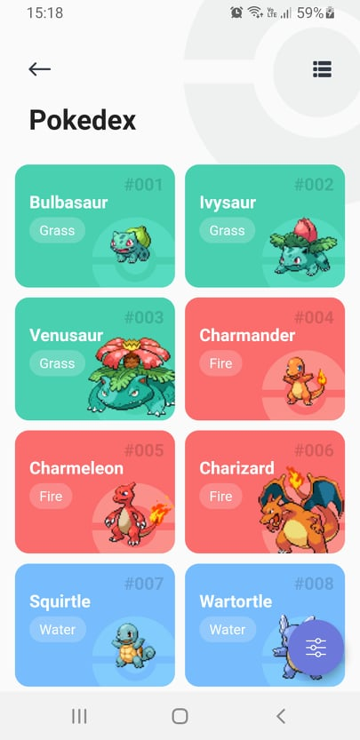

# Pokemon App

Es una aplicación de prueba para el listado de pokemons, de una api rest.

## Aplicación

Para probar la aplicación descargue el repositorio, e instale los paquetes de flutter con:

```
flutter pub get
```

Después seleccione el equipo y ejecute: 

```
flutter run
```

## Imagenes de la aplicación

# Vista Splash


